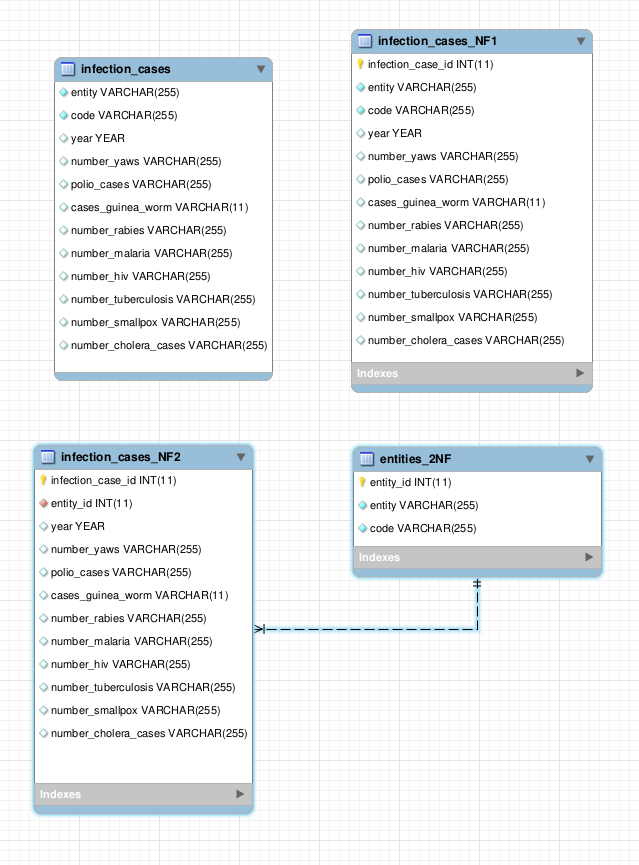

# Фінальний проекту

## Створення бази даних

### Запуск СУБД MySql

```bash
anton@anton-Latitude-7420:~/fp$ docker run --name goit-rdb-fp -e MYSQL_ALLOW_EMPTY_PASSWORD=yes -v ./mysql-files:/var/lib/mysql-files -p 3306:3306 mysql
2025-07-21 21:23:49+00:00 [Note] [Entrypoint]: Entrypoint script for MySQL Server 9.3.0-1.el9 started.
2025-07-21T21:23:57.716365Z 0 [System] [MY-010931] [Server] /usr/sbin/mysqld: ready for connections. Version: '9.3.0'  socket: '/var/run/mysqld/mysqld.sock'  port: 3306  MySQL Community Server - GPL.
```

### Завантаження тестових даних

```bash
anton@anton-Latitude-7420:~/fp$ docker exec -it goit-rdb-fp mysql -uroot --verbose
Welcome to the MySQL monitor.  Commands end with ; or \g.

Your MySQL connection id is 9
Server version: 9.3.0 MySQL Community Server - GPL

mysql> source /var/lib/mysql-files/0_init.sql
--------------
SET GLOBAL local_infile = ON
--------------

Query OK, 0 rows affected (0.001 sec)

--------------
-- Create user
--------------

Query OK, 0 rows affected (0.000 sec)

--------------
CREATE USER 'mwb-user'@'%' IDENTIFIED BY 'sgd-vfv-cx2-34da'
--------------

Query OK, 0 rows affected (0.023 sec)

--------------
GRANT ALL PRIVILEGES ON pandemic.* TO 'mwb-user'@'%'
--------------

Query OK, 0 rows affected (0.004 sec)

--------------
FLUSH PRIVILEGES
--------------

Query OK, 0 rows affected, 1 warning (0.002 sec)

--------------
-- Schema pandemic
--------------

Query OK, 0 rows affected (0.000 sec)

--------------
DROP SCHEMA IF EXISTS `pandemic`
--------------

Query OK, 0 rows affected, 1 warning (0.001 sec)

--------------
CREATE DATABASE `pandemic`
--------------

Query OK, 1 row affected (0.002 sec)

Database changed

Query OK, 0 rows affected (0.000 sec)

--------------
-- Create table
--------------

--------------
CREATE TABLE `infection_cases` (
    `entity` VARCHAR(255) NOT NULL,
    `code` VARCHAR(255) NOT NULL,
    `year` YEAR,
    `number_yaws` varchar(255) default '',
    `polio_cases` varchar(255) default '',
    `cases_guinea_worm` varchar(11) DEFAULT '',
    `number_rabies` varchar(255) default '',
    `number_malaria` varchar(255) default '',
    `number_hiv` varchar(255) default '',
    `number_tuberculosis` varchar(255) default '',
    `number_smallpox` varchar(255) default '',
    `number_cholera_cases` varchar(255) default ''
)
--------------

Query OK, 0 rows affected (0.011 sec)

--------------
LOAD DATA INFILE '/var/lib/mysql-files/infectious_cases.csv' 
INTO TABLE `infection_cases` FIELDS TERMINATED BY ',' ENCLOSED BY '"' LINES TERMINATED BY '\n' IGNORE 1 
ROWS (`entity`, `code`, `year`, `number_yaws`, `polio_cases`, `cases_guinea_worm`, `number_rabies`, `number_malaria`, `number_hiv`, `number_tuberculosis`, `number_smallpox`, `number_cholera_cases`)
--------------

Query OK, 10521 rows affected (0.107 sec)
Records: 10521  Deleted: 0  Skipped: 0  Warnings: 0

--------------
show tables
--------------

+--------------------+
| Tables_in_pandemic |
+--------------------+
| infection_cases    |
+--------------------+
1 row in set (0.001 sec)

--------------
select count(*) from infection_cases
--------------

+----------+
| count(*) |
+----------+
|    10521 |
+----------+
1 row in set (0.001 sec)

```

## Нормалізація даних



Початкові данні перетворено в нормалізовані таблиці в 2 нормальній формі. Отримані таблиці не порушують вимоги 3 нормальної форми. 
Ттому можна важати, що таблиці знаходяться і 3 нормальній формі. 

#### Створення нормалізованих таблиць

```
mysql> source /var/lib/mysql-files/1_create-2nf.sql
--------------
SET FOREIGN_KEY_CHECKS = 0
--------------

Query OK, 0 rows affected (0.000 sec)

--------------
-- Table `pandemic`.`infection_cases_NF2`
--------------

--------------
DROP TABLE IF EXISTS `pandemic`.`infection_cases_NF2`
--------------

Query OK, 0 rows affected, 1 warning (0.004 sec)

--------------
CREATE TABLE IF NOT EXISTS `pandemic`.`infection_cases_NF2` (
  `infection_case_id` INT(11) NOT NULL AUTO_INCREMENT,
  `entity_id` INT(11) NOT NULL,
  `year` YEAR NULL DEFAULT NULL,
  `number_yaws` VARCHAR(255) NULL DEFAULT '',
  `polio_cases` VARCHAR(255) NULL DEFAULT '',
  `cases_guinea_worm` VARCHAR(11) NULL DEFAULT '',
  `number_rabies` VARCHAR(255) NULL DEFAULT '',
  `number_malaria` VARCHAR(255) NULL DEFAULT '',
  `number_hiv` VARCHAR(255) NULL DEFAULT '',
  `number_tuberculosis` VARCHAR(255) NULL DEFAULT '',
  `number_smallpox` VARCHAR(255) NULL DEFAULT '',
  `number_cholera_cases` VARCHAR(255) NULL DEFAULT '',
  PRIMARY KEY (`infection_case_id`),
  INDEX `fk_infection_cases_NF2_1_idx` (`entity_id` ASC) VISIBLE,
  CONSTRAINT `fk_infection_cases_NF2_1`
    FOREIGN KEY (`entity_id`)
    REFERENCES `pandemic`.`entities_2NF` (`entity_id`)
    ON DELETE NO ACTION
    ON UPDATE NO ACTION)
ENGINE = InnoDB
DEFAULT CHARACTER SET = utf8mb4
COLLATE = utf8mb4_0900_ai_ci
--------------

Query OK, 0 rows affected, 2 warnings (0.016 sec)

--------------
DESCRIBE `pandemic`.`infection_cases_NF2`
--------------

+----------------------+--------------+------+-----+---------+----------------+
| Field                | Type         | Null | Key | Default | Extra          |
+----------------------+--------------+------+-----+---------+----------------+
| infection_case_id    | int          | NO   | PRI | NULL    | auto_increment |
| entity_id            | int          | NO   | MUL | NULL    |                |
| year                 | year         | YES  |     | NULL    |                |
| number_yaws          | varchar(255) | YES  |     |         |                |
| polio_cases          | varchar(255) | YES  |     |         |                |
| cases_guinea_worm    | varchar(11)  | YES  |     |         |                |
| number_rabies        | varchar(255) | YES  |     |         |                |
| number_malaria       | varchar(255) | YES  |     |         |                |
| number_hiv           | varchar(255) | YES  |     |         |                |
| number_tuberculosis  | varchar(255) | YES  |     |         |                |
| number_smallpox      | varchar(255) | YES  |     |         |                |
| number_cholera_cases | varchar(255) | YES  |     |         |                |
+----------------------+--------------+------+-----+---------+----------------+
12 rows in set (0.001 sec)

--------------
-- Table `pandemic`.`entities_2NF`
--------------

Query OK, 0 rows affected (0.000 sec)

--------------
DROP TABLE IF EXISTS `pandemic`.`entities_2NF`
--------------

Query OK, 0 rows affected, 1 warning (0.001 sec)

--------------
CREATE TABLE IF NOT EXISTS `pandemic`.`entities_2NF` (
  `entity_id` INT(11) NOT NULL AUTO_INCREMENT,
  `entity` VARCHAR(255) NOT NULL,
  `code` VARCHAR(255) NOT NULL,
  PRIMARY KEY (`entity_id`))
ENGINE = InnoDB
DEFAULT CHARACTER SET = utf8mb4
COLLATE = utf8mb4_0900_ai_ci
--------------

Query OK, 0 rows affected, 1 warning (0.011 sec)

--------------
DESCRIBE `pandemic`.`entities_2NF`
--------------

+-----------+--------------+------+-----+---------+----------------+
| Field     | Type         | Null | Key | Default | Extra          |
+-----------+--------------+------+-----+---------+----------------+
| entity_id | int          | NO   | PRI | NULL    | auto_increment |
| entity    | varchar(255) | NO   |     | NULL    |                |
| code      | varchar(255) | NO   |     | NULL    |                |
+-----------+--------------+------+-----+---------+----------------+
3 rows in set (0.001 sec)

--------------
SET FOREIGN_KEY_CHECKS = 1
--------------

Query OK, 0 rows affected (0.000 sec)

```

#### Експорт даних в нормалізовані таблиці

```
mysql> source /var/lib/mysql-files/2_migrate-data_to_new_tables.sql

--------------
-- Migrate data to `pandemic`.`entities_2NF`
--------------

Query OK, 0 rows affected (0.000 sec)

--------------
INSERT INTO entities_2NF (entity, code)
SELECT DISTINCT entity, code 
FROM infection_cases
--------------

Query OK, 245 rows affected (0.031 sec)
Records: 245  Duplicates: 0  Warnings: 0

--------------
SELECT count(*) FROM entities_2NF
--------------

+----------+
| count(*) |
+----------+
|      245 |
+----------+
1 row in set (0.001 sec)

--------------
-- Migrate data to `pandemic`.`infection_cases_NF2`
--------------

Query OK, 0 rows affected (0.000 sec)

--------------
INSERT INTO infection_cases_NF2 (entity_id, year, number_yaws, polio_cases, cases_guinea_worm, number_rabies, number_malaria, number_hiv, number_tuberculosis, number_smallpox, number_cholera_cases)
SELECT e.entity_id, year, number_yaws, polio_cases, cases_guinea_worm, number_rabies, number_malaria, number_hiv, number_tuberculosis, number_smallpox, number_cholera_cases 
FROM infection_cases i 
LEFT JOIN entities_2NF e ON e.entity=i.entity AND e.code = i.code
--------------

Query OK, 10521 rows affected (0.160 sec)
Records: 10521  Duplicates: 0  Warnings: 0

--------------
SELECT count(*) FROM infection_cases_NF2
--------------

+----------+
| count(*) |
+----------+
|    10521 |
+----------+
1 row in set (0.001 sec)

--------------
-- Compare `pandemic`.`infection_cases_NF2` and `pandemic`.`infection_cases`
--------------

--------------
SELECT 
e2.entity AS entity
, e2.code AS code
, ic2.year
, ic2.number_yaws
, ic2.polio_cases
, ic2.cases_guinea_worm
, ic2.number_rabies
, ic2.number_malaria
, ic2.number_hiv
, ic2.number_tuberculosis
, ic2.number_smallpox
, ic2.number_cholera_cases
FROM infection_cases_NF2 ic2 
LEFT JOIN entities_2NF e2 ON e2.entity_id = ic2.entity_id
EXCEPT
SELECT ic.*
FROM infection_cases ic
--------------

Empty set (0.051 sec)

```

## Завдання

### Aналіз даних

Для кожної унікальної комбінації Entity та Code або їх id порахуйте середнє, мінімальне, максимальне значення та суму для атрибута Number_rabies.
* Результат відсортуйте за порахованим середнім значенням у порядку спадання.
* Оберіть тільки 10 рядків для виведення на екран
* Врахуйте, що атрибут Number_rabies може містити порожні значення ‘’ — вам попередньо необхідно їх відфільтрувати.
* Результат відсортуйте за порахованим середнім значенням у порядку спадання.
* Оберіть тільки 10 рядків для виведення на екран.

```
mysql> source /var/lib/mysql-files/3_data-analysis.sql
--------------
SELECT 
e2.*
, AVG(ic2.number_rabies)
, MIN(ic2.number_rabies)
, MAX(ic2.number_rabies)
, SUM(ic2.number_rabies)
FROM infection_cases_NF2 ic2
LEFT JOIN entities_2NF e2 ON e2.entity_id = ic2.entity_id
WHERE ic2.number_rabies != ''
GROUP BY ic2.entity_id
ORDER BY AVG(ic2.number_rabies) DESC
LIMIT 10
--------------

+-----------+------------------------------+----------+------------------------+------------------------+------------------------+------------------------+
| entity_id | entity                       | code     | AVG(ic2.number_rabies) | MIN(ic2.number_rabies) | MAX(ic2.number_rabies) | SUM(ic2.number_rabies) |
+-----------+------------------------------+----------+------------------------+------------------------+------------------------+------------------------+
|       241 | World                        | OWID_WRL |     20192.370366666666 | 14075.508              | 24744.658              |             605771.111 |
|       121 | Lower Middle Income (WB)     |          |     15193.959383333333 | 10202.528              | 19182.795              |            455818.7815 |
|       202 | South Asia (WB)              |          |     11729.888753333335 | 10136.787              | 9289.771               |     351896.66260000004 |
|       206 | South-East Asia Region (WHO) |          |     11424.326893333337 | 10702.75               | 9701.554               |      342729.8068000001 |
|        77 | G20                          |          |     10189.046003333331 | 10843.914              | 9875.178               |     305671.38009999995 |
|        97 | India                        | IND      |      8599.173279999999 | 10190.644              | 9964.957               |     257975.19839999996 |
|       209 | Sub-Saharan Africa (WB)      |          |     4748.2680900000005 | 4356.8184              | 5017.977               |     142448.04270000002 |
|         3 | African Region (WHO)         |          |      4649.702376666666 | 4283.073               | 4917.784               |     139491.07129999998 |
|       120 | Low Income (WB)              |          |     3568.1054499999996 | 3014.617               | 3873.533               |     107043.16349999998 |
|        58 | East Asia & Pacific (WB)     |          |     3427.4611333333323 | 2009.9395              | 4591.0107              |     102823.83399999997 |
+-----------+------------------------------+----------+------------------------+------------------------+------------------------+------------------------+
10 rows in set (0.021 sec)

```

### Побудуйте колонку різниці в роках

Для оригінальної або нормованої таблиці для колонки Year побудуйте з використанням вбудованих SQL-функцій:

* атрибут, що створює дату першого січня відповідного року,
* атрибут, що дорівнює поточній даті,
* атрибут, що дорівнює різниці в роках двох вищезгаданих колонок.

Наприклад, якщо атрибут містить значення ’1996’, то значення нового атрибута має бути ‘1996-01-01’.
Перераховувати всі інші атрибути, такі як Number_malaria, не потрібно.

```
mysql> source /var/lib/mysql-files/4_year-diff.sql
--------------
SELECT 
src.*
, CURRENT_DATE()
, TIMESTAMPDIFF(YEAR, src.date_from_year, CURRENT_DATE()) AS years_difference
FROM (
    SELECT 
	e2.*
	, ic2.year
	, STR_TO_DATE(CONCAT(ic2.year, '-', '01', '-', '01'), '%Y-%m-%d') AS date_from_year
    FROM infection_cases_NF2 ic2
    LEFT JOIN entities_2NF e2 
    ON e2.entity_id = ic2.entity_id
) src
LIMIT 100
--------------

+-----------+----------------------+------+------+----------------+----------------+------------------+
| entity_id | entity               | code | year | date_from_year | CURRENT_DATE() | years_difference |
+-----------+----------------------+------+------+----------------+----------------+------------------+
|         1 | Afghanistan          | AFG  | 1980 | 1980-01-01     | 2025-07-31     |               45 |
|         1 | Afghanistan          | AFG  | 1981 | 1981-01-01     | 2025-07-31     |               44 |
|         1 | Afghanistan          | AFG  | 1982 | 1982-01-01     | 2025-07-31     |               43 |
|         1 | Afghanistan          | AFG  | 1983 | 1983-01-01     | 2025-07-31     |               42 |
|         1 | Afghanistan          | AFG  | 1984 | 1984-01-01     | 2025-07-31     |               41 |
|         1 | Afghanistan          | AFG  | 1985 | 1985-01-01     | 2025-07-31     |               40 |
|         1 | Afghanistan          | AFG  | 1986 | 1986-01-01     | 2025-07-31     |               39 |
|         1 | Afghanistan          | AFG  | 1987 | 1987-01-01     | 2025-07-31     |               38 |
|         1 | Afghanistan          | AFG  | 1988 | 1988-01-01     | 2025-07-31     |               37 |
|         1 | Afghanistan          | AFG  | 1989 | 1989-01-01     | 2025-07-31     |               36 |
|         1 | Afghanistan          | AFG  | 1990 | 1990-01-01     | 2025-07-31     |               35 |
|         1 | Afghanistan          | AFG  | 1991 | 1991-01-01     | 2025-07-31     |               34 |
|         1 | Afghanistan          | AFG  | 1995 | 1995-01-01     | 2025-07-31     |               30 |
|         1 | Afghanistan          | AFG  | 1997 | 1997-01-01     | 2025-07-31     |               28 |
|         1 | Afghanistan          | AFG  | 1998 | 1998-01-01     | 2025-07-31     |               27 |
|         1 | Afghanistan          | AFG  | 1999 | 1999-01-01     | 2025-07-31     |               26 |
|         1 | Afghanistan          | AFG  | 2000 | 2000-01-01     | 2025-07-31     |               25 |
|         1 | Afghanistan          | AFG  | 2001 | 2001-01-01     | 2025-07-31     |               24 |
|         1 | Afghanistan          | AFG  | 2002 | 2002-01-01     | 2025-07-31     |               23 |
|         1 | Afghanistan          | AFG  | 2003 | 2003-01-01     | 2025-07-31     |               22 |
|         1 | Afghanistan          | AFG  | 2004 | 2004-01-01     | 2025-07-31     |               21 |
|         1 | Afghanistan          | AFG  | 2005 | 2005-01-01     | 2025-07-31     |               20 |
|         1 | Afghanistan          | AFG  | 2006 | 2006-01-01     | 2025-07-31     |               19 |
|         1 | Afghanistan          | AFG  | 2007 | 2007-01-01     | 2025-07-31     |               18 |
|         1 | Afghanistan          | AFG  | 2008 | 2008-01-01     | 2025-07-31     |               17 |
|         1 | Afghanistan          | AFG  | 2009 | 2009-01-01     | 2025-07-31     |               16 |
|         1 | Afghanistan          | AFG  | 2010 | 2010-01-01     | 2025-07-31     |               15 |
|         1 | Afghanistan          | AFG  | 2011 | 2011-01-01     | 2025-07-31     |               14 |
|         1 | Afghanistan          | AFG  | 2012 | 2012-01-01     | 2025-07-31     |               13 |
|         1 | Afghanistan          | AFG  | 2013 | 2013-01-01     | 2025-07-31     |               12 |
|         1 | Afghanistan          | AFG  | 2014 | 2014-01-01     | 2025-07-31     |               11 |
|         1 | Afghanistan          | AFG  | 2015 | 2015-01-01     | 2025-07-31     |               10 |
|         1 | Afghanistan          | AFG  | 2016 | 2016-01-01     | 2025-07-31     |                9 |
|         1 | Afghanistan          | AFG  | 2017 | 2017-01-01     | 2025-07-31     |                8 |
|         1 | Afghanistan          | AFG  | 2018 | 2018-01-01     | 2025-07-31     |                7 |
|         1 | Afghanistan          | AFG  | 2019 | 2019-01-01     | 2025-07-31     |                6 |
|         1 | Afghanistan          | AFG  | 2020 | 2020-01-01     | 2025-07-31     |                5 |
|         1 | Afghanistan          | AFG  | 1992 | 1992-01-01     | 2025-07-31     |               33 |
|         1 | Afghanistan          | AFG  | 1993 | 1993-01-01     | 2025-07-31     |               32 |
|         1 | Afghanistan          | AFG  | 1994 | 1994-01-01     | 2025-07-31     |               31 |
|         1 | Afghanistan          | AFG  | 1996 | 1996-01-01     | 2025-07-31     |               29 |
|         1 | Afghanistan          | AFG  | 2021 | 2021-01-01     | 2025-07-31     |                4 |
|         1 | Afghanistan          | AFG  | 2022 | 2022-01-01     | 2025-07-31     |                3 |
|         1 | Afghanistan          | AFG  | 1960 | 1960-01-01     | 2025-07-31     |               65 |
|         1 | Afghanistan          | AFG  | 1965 | 1965-01-01     | 2025-07-31     |               60 |
|         2 | Africa               |      | 1980 | 1980-01-01     | 2025-07-31     |               45 |
|         2 | Africa               |      | 1981 | 1981-01-01     | 2025-07-31     |               44 |
|         2 | Africa               |      | 1982 | 1982-01-01     | 2025-07-31     |               43 |
|         2 | Africa               |      | 1983 | 1983-01-01     | 2025-07-31     |               42 |
|         2 | Africa               |      | 1984 | 1984-01-01     | 2025-07-31     |               41 |
|         2 | Africa               |      | 1985 | 1985-01-01     | 2025-07-31     |               40 |
|         2 | Africa               |      | 1986 | 1986-01-01     | 2025-07-31     |               39 |
|         2 | Africa               |      | 1987 | 1987-01-01     | 2025-07-31     |               38 |
|         2 | Africa               |      | 1988 | 1988-01-01     | 2025-07-31     |               37 |
|         2 | Africa               |      | 1989 | 1989-01-01     | 2025-07-31     |               36 |
|         2 | Africa               |      | 1990 | 1990-01-01     | 2025-07-31     |               35 |
|         2 | Africa               |      | 1991 | 1991-01-01     | 2025-07-31     |               34 |
|         2 | Africa               |      | 1992 | 1992-01-01     | 2025-07-31     |               33 |
|         2 | Africa               |      | 1993 | 1993-01-01     | 2025-07-31     |               32 |
|         2 | Africa               |      | 1994 | 1994-01-01     | 2025-07-31     |               31 |
|         2 | Africa               |      | 1995 | 1995-01-01     | 2025-07-31     |               30 |
|         2 | Africa               |      | 1996 | 1996-01-01     | 2025-07-31     |               29 |
|         2 | Africa               |      | 1997 | 1997-01-01     | 2025-07-31     |               28 |
|         2 | Africa               |      | 1998 | 1998-01-01     | 2025-07-31     |               27 |
|         2 | Africa               |      | 1999 | 1999-01-01     | 2025-07-31     |               26 |
|         2 | Africa               |      | 2000 | 2000-01-01     | 2025-07-31     |               25 |
|         2 | Africa               |      | 2001 | 2001-01-01     | 2025-07-31     |               24 |
|         2 | Africa               |      | 2002 | 2002-01-01     | 2025-07-31     |               23 |
|         2 | Africa               |      | 2003 | 2003-01-01     | 2025-07-31     |               22 |
|         2 | Africa               |      | 2004 | 2004-01-01     | 2025-07-31     |               21 |
|         2 | Africa               |      | 2005 | 2005-01-01     | 2025-07-31     |               20 |
|         2 | Africa               |      | 2006 | 2006-01-01     | 2025-07-31     |               19 |
|         2 | Africa               |      | 2007 | 2007-01-01     | 2025-07-31     |               18 |
|         2 | Africa               |      | 2008 | 2008-01-01     | 2025-07-31     |               17 |
|         2 | Africa               |      | 2009 | 2009-01-01     | 2025-07-31     |               16 |
|         2 | Africa               |      | 2010 | 2010-01-01     | 2025-07-31     |               15 |
|         2 | Africa               |      | 2011 | 2011-01-01     | 2025-07-31     |               14 |
|         2 | Africa               |      | 2012 | 2012-01-01     | 2025-07-31     |               13 |
|         2 | Africa               |      | 2013 | 2013-01-01     | 2025-07-31     |               12 |
|         2 | Africa               |      | 2014 | 2014-01-01     | 2025-07-31     |               11 |
|         2 | Africa               |      | 2015 | 2015-01-01     | 2025-07-31     |               10 |
|         2 | Africa               |      | 2016 | 2016-01-01     | 2025-07-31     |                9 |
|         2 | Africa               |      | 2017 | 2017-01-01     | 2025-07-31     |                8 |
|         2 | Africa               |      | 2018 | 2018-01-01     | 2025-07-31     |                7 |
|         2 | Africa               |      | 2019 | 2019-01-01     | 2025-07-31     |                6 |
|         2 | Africa               |      | 2020 | 2020-01-01     | 2025-07-31     |                5 |
|         2 | Africa               |      | 1970 | 1970-01-01     | 2025-07-31     |               55 |
|         2 | Africa               |      | 1971 | 1971-01-01     | 2025-07-31     |               54 |
|         2 | Africa               |      | 1972 | 1972-01-01     | 2025-07-31     |               53 |
|         2 | Africa               |      | 1973 | 1973-01-01     | 2025-07-31     |               52 |
|         2 | Africa               |      | 1974 | 1974-01-01     | 2025-07-31     |               51 |
|         2 | Africa               |      | 1975 | 1975-01-01     | 2025-07-31     |               50 |
|         2 | Africa               |      | 1976 | 1976-01-01     | 2025-07-31     |               49 |
|         2 | Africa               |      | 1977 | 1977-01-01     | 2025-07-31     |               48 |
|         2 | Africa               |      | 1978 | 1978-01-01     | 2025-07-31     |               47 |
|         2 | Africa               |      | 1979 | 1979-01-01     | 2025-07-31     |               46 |
|         2 | Africa               |      | 2021 | 2021-01-01     | 2025-07-31     |                4 |
|         3 | African Region (WHO) |      | 1990 | 1990-01-01     | 2025-07-31     |               35 |
|         3 | African Region (WHO) |      | 1991 | 1991-01-01     | 2025-07-31     |               34 |
|         3 | African Region (WHO) |      | 1992 | 1992-01-01     | 2025-07-31     |               33 |
+-----------+----------------------+------+------+----------------+----------------+------------------+
100 rows in set (0.002 sec)

```

### Побудуйте власну функцію

Створіть і використайте функцію, що будує такий же атрибут, як і в попередньому завданні: функція має приймати на вхід значення року, а повертати різницю в роках між поточною датою та датою, створеною з атрибута року (1996 рік → ‘1996-01-01’).

```
mysql> source /var/lib/mysql-files/5_year-diff_func.sql
--------------
DROP FUNCTION IF EXISTS years_difference
--------------

Query OK, 0 rows affected, 1 warning (0.003 sec)

--------------
CREATE FUNCTION years_difference(year_value YEAR)
RETURNS INT
DETERMINISTIC
BEGIN
    -- Declare local variables if needed
    DECLARE date_from_year DATE;
    DECLARE result INT;

    -- Function logic
    SET date_from_year = STR_TO_DATE(CONCAT(year_value, '-', '01', '-', '01'), '%Y-%m-%d'); 
    SET result = TIMESTAMPDIFF(YEAR, date_from_year, CURRENT_DATE());

    -- Return the result
    RETURN result;
END
--------------

Query OK, 0 rows affected (0.003 sec)

--------------
SELECT 
e2.*
, ic2.year
, years_difference(ic2.year)
FROM infection_cases_NF2 ic2
LEFT JOIN entities_2NF e2 
ON e2.entity_id = ic2.entity_id
LIMIT 100
--------------

+-----------+----------------------+------+------+----------------------------+
| entity_id | entity               | code | year | years_difference(ic2.year) |
+-----------+----------------------+------+------+----------------------------+
|         1 | Afghanistan          | AFG  | 1980 |                         45 |
|         1 | Afghanistan          | AFG  | 1981 |                         44 |
|         1 | Afghanistan          | AFG  | 1982 |                         43 |
|         1 | Afghanistan          | AFG  | 1983 |                         42 |
|         1 | Afghanistan          | AFG  | 1984 |                         41 |
|         1 | Afghanistan          | AFG  | 1985 |                         40 |
|         1 | Afghanistan          | AFG  | 1986 |                         39 |
|         1 | Afghanistan          | AFG  | 1987 |                         38 |
|         1 | Afghanistan          | AFG  | 1988 |                         37 |
|         1 | Afghanistan          | AFG  | 1989 |                         36 |
|         1 | Afghanistan          | AFG  | 1990 |                         35 |
|         1 | Afghanistan          | AFG  | 1991 |                         34 |
|         1 | Afghanistan          | AFG  | 1995 |                         30 |
|         1 | Afghanistan          | AFG  | 1997 |                         28 |
|         1 | Afghanistan          | AFG  | 1998 |                         27 |
|         1 | Afghanistan          | AFG  | 1999 |                         26 |
|         1 | Afghanistan          | AFG  | 2000 |                         25 |
|         1 | Afghanistan          | AFG  | 2001 |                         24 |
|         1 | Afghanistan          | AFG  | 2002 |                         23 |
|         1 | Afghanistan          | AFG  | 2003 |                         22 |
|         1 | Afghanistan          | AFG  | 2004 |                         21 |
|         1 | Afghanistan          | AFG  | 2005 |                         20 |
|         1 | Afghanistan          | AFG  | 2006 |                         19 |
|         1 | Afghanistan          | AFG  | 2007 |                         18 |
|         1 | Afghanistan          | AFG  | 2008 |                         17 |
|         1 | Afghanistan          | AFG  | 2009 |                         16 |
|         1 | Afghanistan          | AFG  | 2010 |                         15 |
|         1 | Afghanistan          | AFG  | 2011 |                         14 |
|         1 | Afghanistan          | AFG  | 2012 |                         13 |
|         1 | Afghanistan          | AFG  | 2013 |                         12 |
|         1 | Afghanistan          | AFG  | 2014 |                         11 |
|         1 | Afghanistan          | AFG  | 2015 |                         10 |
|         1 | Afghanistan          | AFG  | 2016 |                          9 |
|         1 | Afghanistan          | AFG  | 2017 |                          8 |
|         1 | Afghanistan          | AFG  | 2018 |                          7 |
|         1 | Afghanistan          | AFG  | 2019 |                          6 |
|         1 | Afghanistan          | AFG  | 2020 |                          5 |
|         1 | Afghanistan          | AFG  | 1992 |                         33 |
|         1 | Afghanistan          | AFG  | 1993 |                         32 |
|         1 | Afghanistan          | AFG  | 1994 |                         31 |
|         1 | Afghanistan          | AFG  | 1996 |                         29 |
|         1 | Afghanistan          | AFG  | 2021 |                          4 |
|         1 | Afghanistan          | AFG  | 2022 |                          3 |
|         1 | Afghanistan          | AFG  | 1960 |                         65 |
|         1 | Afghanistan          | AFG  | 1965 |                         60 |
|         2 | Africa               |      | 1980 |                         45 |
|         2 | Africa               |      | 1981 |                         44 |
|         2 | Africa               |      | 1982 |                         43 |
|         2 | Africa               |      | 1983 |                         42 |
|         2 | Africa               |      | 1984 |                         41 |
|         2 | Africa               |      | 1985 |                         40 |
|         2 | Africa               |      | 1986 |                         39 |
|         2 | Africa               |      | 1987 |                         38 |
|         2 | Africa               |      | 1988 |                         37 |
|         2 | Africa               |      | 1989 |                         36 |
|         2 | Africa               |      | 1990 |                         35 |
|         2 | Africa               |      | 1991 |                         34 |
|         2 | Africa               |      | 1992 |                         33 |
|         2 | Africa               |      | 1993 |                         32 |
|         2 | Africa               |      | 1994 |                         31 |
|         2 | Africa               |      | 1995 |                         30 |
|         2 | Africa               |      | 1996 |                         29 |
|         2 | Africa               |      | 1997 |                         28 |
|         2 | Africa               |      | 1998 |                         27 |
|         2 | Africa               |      | 1999 |                         26 |
|         2 | Africa               |      | 2000 |                         25 |
|         2 | Africa               |      | 2001 |                         24 |
|         2 | Africa               |      | 2002 |                         23 |
|         2 | Africa               |      | 2003 |                         22 |
|         2 | Africa               |      | 2004 |                         21 |
|         2 | Africa               |      | 2005 |                         20 |
|         2 | Africa               |      | 2006 |                         19 |
|         2 | Africa               |      | 2007 |                         18 |
|         2 | Africa               |      | 2008 |                         17 |
|         2 | Africa               |      | 2009 |                         16 |
|         2 | Africa               |      | 2010 |                         15 |
|         2 | Africa               |      | 2011 |                         14 |
|         2 | Africa               |      | 2012 |                         13 |
|         2 | Africa               |      | 2013 |                         12 |
|         2 | Africa               |      | 2014 |                         11 |
|         2 | Africa               |      | 2015 |                         10 |
|         2 | Africa               |      | 2016 |                          9 |
|         2 | Africa               |      | 2017 |                          8 |
|         2 | Africa               |      | 2018 |                          7 |
|         2 | Africa               |      | 2019 |                          6 |
|         2 | Africa               |      | 2020 |                          5 |
|         2 | Africa               |      | 1970 |                         55 |
|         2 | Africa               |      | 1971 |                         54 |
|         2 | Africa               |      | 1972 |                         53 |
|         2 | Africa               |      | 1973 |                         52 |
|         2 | Africa               |      | 1974 |                         51 |
|         2 | Africa               |      | 1975 |                         50 |
|         2 | Africa               |      | 1976 |                         49 |
|         2 | Africa               |      | 1977 |                         48 |
|         2 | Africa               |      | 1978 |                         47 |
|         2 | Africa               |      | 1979 |                         46 |
|         2 | Africa               |      | 2021 |                          4 |
|         3 | African Region (WHO) |      | 1990 |                         35 |
|         3 | African Region (WHO) |      | 1991 |                         34 |
|         3 | African Region (WHO) |      | 1992 |                         33 |
+-----------+----------------------+------+------+----------------------------+
100 rows in set (0.001 sec)
```
